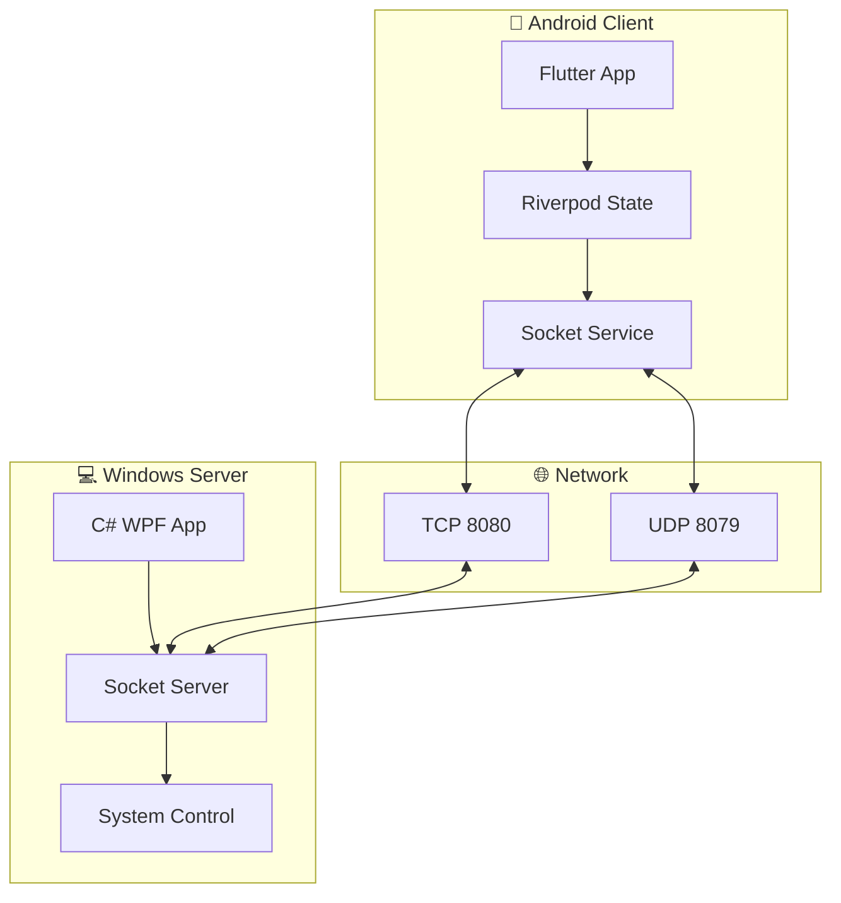

# 🖱️ PalmController - 掌控者

<div align="center">


**🚀 用手机轻松控制你的电脑 - 零配置，即连即用**

[](https://github.com/Mutx163/androidwin/releases)
[](https://github.com/Mutx163/androidwin/actions)
[](https://flutter.dev/)
[](https://dotnet.microsoft.com/)
[](https://opensource.org/licenses/MIT)
[](https://github.com/Mutx163/androidwin/stargazers)

[📱 下载APK](https://github.com/Mutx163/androidwin/releases) • [💻 下载PC端](https://github.com/Mutx163/androidwin/releases) • [📖 文档](https://github.com/Mutx163/androidwin/wiki) • [🐛 报告问题](https://github.com/Mutx163/androidwin/issues)

</div>

---

## ✨ 特性亮点

<table>
<tr>
<td width="50%">

### 🎯 **即连即用**
- 🔍 **自动发现设备** - 局域网零配置连接
- ⚡ **启动即连接** - 应用启动自动连接PC
- 🌐 **多设备支持** - 同时管理多台电脑

</td>
<td width="50%">

### 🖱️ **精确控制**
- 👆 **触摸板模式** - 手势识别，灵敏度可调
- ⌨️ **键盘输入** - 完整键盘支持，快捷键组合
- 🎮 **媒体控制** - 播放/暂停/音量，状态实时同步

</td>
</tr>
<tr>
<td width="50%">

### 🎨 **现代设计**
- 🌙 **深色/浅色主题** - Material Design 3
- 📱 **响应式界面** - 适配各种屏幕尺寸
- ✨ **流畅动画** - 60fps流畅体验

</td>
<td width="50%">

### 🛡️ **安全可靠**
- 🔒 **本地网络** - 数据不上传云端
- 🔧 **开源透明** - 代码完全开源
- 📊 **高质量代码** - 99%代码质量评分

</td>
</tr>
</table>

---

## 🖼️ 应用截图

<div align="center">

| 连接界面 | 触摸板控制 | 媒体控制 | 设置页面 |
|:---:|:---:|:---:|:---:|
|  |  |  |  |

</div>

---

## 🚀 快速开始

### 📱 Android 用户

1. **下载安装**
   ```bash
   # 下载最新版本APK
   wget https://github.com/Mutx163/androidwin/releases/latest/download/app-release.apk
   ```

2. **安装权限**
   - 允许安装未知来源应用
   - 启动应用，按提示给予权限

### 💻 Windows 用户

1. **下载运行**
   ```bash
   # 下载Windows程序
   wget https://github.com/Mutx163/androidwin/releases/latest/download/PalmControllerServer.exe
   ```

2. **启动服务**
   - 双击运行 `PalmControllerServer.exe`
   - 首次运行需允许防火墙访问

### 🔗 连接使用

1. **确保同一网络** - 手机和电脑连接同一Wi-Fi
2. **启动两端程序** - 先启动PC端，再启动手机端
3. **自动连接** - 应用会自动发现并连接PC
4. **开始控制** - 享受无线控制体验！

---

## 🛠️ 开发者指南

### 📋 环境要求

<table>
<tr>
<td><strong>Android 端</strong></td>
<td><strong>Windows 端</strong></td>
</tr>
<tr>
<td>

- Flutter SDK 3.24+
- Dart 3.5+
- Android Studio / VS Code
- Android 6.0+ 设备

</td>
<td>

- .NET 9.0 SDK
- Visual Studio 2022 / VS Code
- Windows 10+ 系统

</td>
</tr>
</table>

### 🔨 本地开发

```bash
# 克隆仓库
git clone https://github.com/Mutx163/androidwin.git
cd androidwin

# Android 端开发
cd palm_controller_app
flutter pub get
flutter run

# Windows 端开发
cd ../PalmControllerServer
dotnet restore
dotnet build
dotnet run
```

### 🧪 运行测试

```bash
# Flutter 测试
cd palm_controller_app
flutter test

# .NET 测试
cd ../PalmControllerServer
dotnet test
```

---

## 🏗️ 技术架构

<div align="center">



</div>

### 🔧 技术栈

| 层级 | Android | Windows | 协议 |
|------|---------|---------|------|
| **前端** | Flutter + Material Design 3 | WPF + Modern UI | - |
| **状态管理** | Riverpod | Built-in | - |
| **通信** | Dart Socket | C# Socket | TCP/UDP |
| **消息格式** | JSON | JSON | 统一协议 |
| **构建工具** | Flutter Build | .NET CLI | GitHub Actions |

---

## 📈 项目状态

<div align="center">


</div>

### 🎯 完成度: 99% ✅

- ✅ **核心功能** - 鼠标/键盘/媒体控制
- ✅ **自动连接** - 零配置设备发现
- ✅ **现代UI** - Material Design 3
- ✅ **跨平台** - Android + Windows
- ✅ **高质量代码** - 代码分析99%通过
- ✅ **CI/CD** - 自动构建发布
- 🔄 **性能优化** - 持续改进中

---

## 🤝 参与贡献

我们欢迎所有形式的贡献！无论是新功能、bug修复、文档改进还是设计建议。

### 🌟 如何贡献

1. **🍴 Fork** 这个仓库
2. **🌿 创建分支** (`git checkout -b feature/amazing-feature`)
3. **💻 编写代码** 并确保测试通过
4. **📝 提交更改** (`git commit -m '✨ Add amazing feature'`)
5. **🚀 推送分支** (`git push origin feature/amazing-feature`)
6. **🔀 创建 Pull Request**

### 📋 贡献类型

- 🐛 **Bug 修复** - 发现并修复问题
- ✨ **新功能** - 添加新的功能特性
- 📚 **文档** - 改进文档和示例
- 🎨 **UI/UX** - 界面和交互优化
- ⚡ **性能** - 性能优化和代码重构
- 🌍 **国际化** - 多语言支持

---

## 📞 支持与反馈

<div align="center">

### 💬 **需要帮助？**

[](https://github.com/Mutx163/androidwin/discussions)
[](https://github.com/Mutx163/androidwin/issues)
[](mailto:your-email@example.com)

**🐛 发现问题？** [创建 Issue](https://github.com/Mutx163/androidwin/issues/new/choose)

**💡 功能建议？** [功能请求](https://github.com/Mutx163/androidwin/discussions/categories/ideas)

**❓ 使用疑问？** [讨论区](https://github.com/Mutx163/androidwin/discussions)

</div>

---

## 📄 开源协议

本项目基于 [MIT License](LICENSE) 开源协议。

```
MIT License - 你可以自由地使用、修改、分发此项目
```

---

## 🙏 致谢

感谢所有贡献者的辛勤付出！

<div align="center">

[](https://github.com/Mutx163/androidwin/graphs/contributors)

### ⭐ 如果这个项目对你有帮助，请给一个Star！

[](https://star-history.com/#Mutx163/androidwin&Date)

</div>

---

<div align="center">

**🚀 让我们一起打造更好的远程控制体验！**

[⬆️ 回到顶部](#-palmcontroller---掌控者)

</div> 